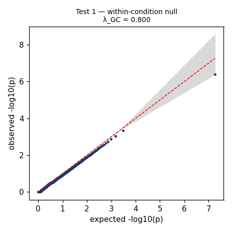
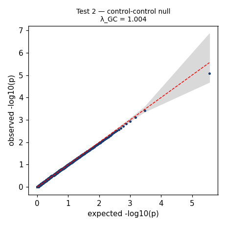

# Robustness report — adata_Validation__pdex__20260608-202126

- **dataset**: `/home/yangzhang/code/cell-eval/adata_Validation.h5ad`
- **DE backend**: `pdex` (cell-level Wilcoxon; data normalize_total+log1p, is_log1p=True)
- **pert_col / control**: `target_gene` / `non-targeting`  |  **sgrna_col**: `guide_id`  |  **replicate_col**: `batch`
- **scale**: full, n_permutations=10, seed=0
- **GLOBAL VERDICT**: ⚠️ **WARN**  (validity gates tests 1–3 must PASS before interpreting tests 4–6)

> A validity gate WARNed — results are usable but read the flagged caveats (often a deflated/under-powered null) before interpreting tests 4–6.

## Verification parameters & thresholds

| parameter | value | source |
|---|---|---|
| de_method | pdex | config |
| allow_discrete / normalize_if_raw | False / True | config |
| fdr_threshold | 0.05 | config |
| lfc_threshold | 0.1 | config |
| lambda_gc_warn / fail | 1.05 / 1.1 | TEST_PLAN.md |
| lambda_gc deflation WARN | < 0.90 | skill verdict notes |
| ks_p_uniform WARN | < 0.05 | skill verdict notes |
| n_permutations | 10 | config |
| min_cells_per_group | 20 | config |
| seed | 0 | config |
| max_conditions | None | config |
| block_cols (stratify) | ['batch'] | config |
| test-3 separation PASS / WARN | > 2 / 1–2 | TEST_PLAN.md |
| test-4 LOW-REPRODUCIBILITY flag | median LFC ρ < 0.2 | TEST_PLAN.md |
| test-5 separation PASS / WARN | > 1.5 / 1.0–1.5 | TEST_PLAN.md |
| test-6 recovery / direction PASS | > 0.5 / > 0.8 | TEST_PLAN.md |

## Test summary

| test | verdict | headline |
|---|---|---|
| test_1 — Within-Condition Direct Split Null | ⚠️ WARN | frac_sig=2.862e-06, mean_lfc=0.001775, mean_abs_lfc=0.1952, lambda_gc=0.7984, ks_p_uniform=3.957e-128, lambda_gc_sd=0.05431 |
| test_2 — Control-Control Split Null | ⚠️ WARN | frac_sig=0, mean_lfc=0.0009492, mean_abs_lfc=0.1071, lambda_gc=1.005, ks_p_uniform=2.161e-14, lambda_gc_sd=0.03175 |
| test_3 — Label Permutation Null | ✅ PASS | true_signal=0.1475, perm_mean=0.007087, perm_sd=9.87e-05, separation_z=1423 |
| test_4 — Same-sgRNA Split Reproducibility | ✅ PASS | n_guides=54, median_lfc_spearman=0.2866, median_jaccard=0.2891, median_direction=0.8285 |
| test_5 — Same-Gene Independent sgRNA Reproducibility | ❌ FAIL | n_genes=4, n_same_pairs=4, same_gene_mean_rho=0.119, background_mean_rho=0.0458, separation_z=0.5281 |
| test_6 — Target Gene Knockdown Recovery | ✅ PASS | n_targets=50, recovery_rate=1, direction_rate=1, median_pval_rank=5.531e-05, median_lfc_rank=0.1076 |

## test_1 — Within-Condition Direct Split Null  ⚠️ WARN

- `frac_sig` = 2.8624193544954597e-06
- `mean_lfc` = 0.0017745508068358262
- `mean_abs_lfc` = 0.19523047652509917
- `lambda_gc` = 0.7984290521084172
- `ks_p_uniform` = 3.9574470333362476e-128
- `lambda_gc_sd` = 0.054310003160526775

**p-values (verification):** `ks_p_uniform_mean` = 3.957e-128, `lambda_gc` = 0.7984

- ⚠️ λ_GC=0.798 < 0.9 (deflated null — under-powered)
- ⚠️ ks_p_uniform=3.96e-128 < 0.05 (p-values not Uniform[0,1])
- ⚠️ split-to-split SD(λ_GC)=0.054 > 0.05 (residual confounding?)



Tables: see `tables/test_1__*.csv`

## test_2 — Control-Control Split Null  ⚠️ WARN

- `frac_sig` = 0.0
- `mean_lfc` = 0.0009491504834339152
- `mean_abs_lfc` = 0.10714077880111354
- `lambda_gc` = 1.0049644906546602
- `ks_p_uniform` = 2.1610054394678046e-14
- `lambda_gc_sd` = 0.03174649284163869

**p-values (verification):** `ks_p_uniform_mean` = 2.161e-14, `lambda_gc` = 1.005

- ⚠️ ks_p_uniform=2.16e-14 < 0.05 (p-values not Uniform[0,1])



Tables: see `tables/test_2__*.csv`

## test_3 — Label Permutation Null  ✅ PASS

- `true_signal` = 0.14751216814159293
- `perm_mean` = 0.007086836283185842
- `perm_sd` = 9.869787552799573e-05
- `separation_z` = 1422.7796809929848

**p-values (verification):** `perm_p` = 0, `separation_z` = 1423

Tables: see `tables/test_3__*.csv`

## test_4 — Same-sgRNA Split Reproducibility  ✅ PASS

- `n_guides` = 54
- `median_lfc_spearman` = 0.2865950163645664
- `median_jaccard` = 0.2890805780399689
- `median_direction` = 0.8284725299069562

Tables: see `tables/test_4__*.csv`

## test_5 — Same-Gene Independent sgRNA Reproducibility  ❌ FAIL

- `n_genes` = 4
- `n_same_pairs` = 4
- `same_gene_mean_rho` = 0.11898355123049015
- `background_mean_rho` = 0.0458045748388922
- `separation_z` = 0.5281370181808444

**p-values (verification):** `separation_z` = 0.5281

Tables: see `tables/test_5__*.csv`

## test_6 — Target Gene Knockdown Recovery  ✅ PASS

- `n_targets` = 50
- `recovery_rate` = 1.0
- `direction_rate` = 1.0
- `median_pval_rank` = 5.5309734513274336e-05
- `median_lfc_rank` = 0.10763274336283186

**p-values (verification):** `median_padj_target` = 0

Tables: see `tables/test_6__*.csv`

## Power & sample-size analysis (TEST_PLAN.md §7)

### §7.6 Realized parameters table

| parameter | source | realized value |
|---|---|---|
| α_empirical | Tests 1–2 mean λ_GC | 0.05 |
| λ_GC (mean of gates) | Tests 1–2 | 0.9017 |
| φ_median (approx) | control counts MoM | 0.001 |
| δ_floor | true DE 10th pct |LFC| | 0.1265 |
| δ_typical | true DE median |LFC| | 0.2856 |
| δ_ceiling | true DE 90th pct |LFC| | 1.127 |
| ρ_reproducibility | Test 4 median LFC ρ | 0.2866 |
| δ_effective = δ_typ·√ρ | derived | 0.1529 |
| n_required (δ_typical, 80%) | power formula | 464.4 |
| n_required (δ_effective, 80%) | power formula | 1620 |
| n_required (δ_floor, 80%) | power formula | 2369 |

- **α note:** lambda_gc < 1 (deflation) -> alpha_empirical = fdr_threshold (NOT inflated); investigate covariate overcorrection / under-powered null
- **caveat:** pdex is cell-level Wilcoxon (no NB dispersion fit); phi approximated by method-of-moments on control counts. Power is a planning estimate, not DESeq2-derived.

## Appendix — embedded TEST_PLAN.md

## Cell Metrics Robustness & Stability Test Plan

> **Purpose.** Validate that a cell-metrics evaluation pipeline produces calibrated, unbiased results before interpreting biological findings. Tests 1–3 are **validity gates** — all must pass before proceeding. Tests 4–6 are **sensitivity diagnostics** — they characterise how much signal the data contains and set empirical ceilings for downstream metrics.

---

### Inputs

#### Required

| Field | Type | Description |
|---|---|---|
| `adata` | `AnnData` | Cells × genes count matrix |
| `perturbation_col` | `str` | `obs` column containing sgRNA / perturbation labels |
| `control_label` | `str` | Value in `perturbation_col` identifying control cells |

#### Recommended

| Field | Type | Description |
|---|---|---|
| `target_gene_map` | `dict[str, str]` | sgRNA → target gene name |
| `batch_cols` | `list[str]` | e.g. `['batch', 'donor', 'replicate', 'cell_type']` |
| `cell_cycle_col` | `str` | `obs` column for cell-cycle phase |
| `guide_efficacy` | `dict[str, float]` | sgRNA → knockdown efficiency estimate |
| `baseline_expression` | `dict[str, float]` | Gene → baseline expression level |

#### Parameters

| Parameter | Default | Description |
|---|---|---|
| `n_permutations` | `10` | Resampling iterations for Tests 2 and 3 |
| `min_cells_per_group` | `20` | Minimum cells per split arm; skip condition if not met |
| `fdr_threshold` | `0.05` | BH-adjusted p-value cutoff for significance calls |
| `lfc_threshold` | `0.1` | Minimum \|LFC\| for a gene to be called significant |
| `lambda_gc_warn` | `1.05` | λ_GC threshold above which a WARN is issued |
| `lambda_gc_fail` | `1.10` | λ_GC threshold above which a FAIL is issued |

---

### Shared Notation

| Symbol | Definition |
|---|---|
| G | Number of genes tested |
| p(g) | Raw p-value for gene g |
| q(g) | BH-adjusted p-value for gene g |
| LFC(g) | Log₂ fold change for gene g |
| S | Set of significant genes: `{g : q(g) ≤ fdr_threshold AND \|LFC(g)\| ≥ lfc_threshold}` |
| F̂(x) | Empirical CDF of `{p(g)}_g` evaluated at x |
| χ²₁⁻¹(p) | Inverse CDF of the χ²(1) distribution at probability p |

---

### Shared Formulas

All six tests report the following metrics where DE results are available.

#### Fraction Significant

```
frac_sig = |S| / G
```

Reported as the mean over conditions. Approximates the empirical false-positive rate under a true null. Expected value ≈ `fdr_threshold` when the null holds.

#### Mean and Mean Absolute LFC

```
mean_lfc     = (1/G) Σ_g LFC(g)
mean_abs_lfc = (1/G) Σ_g |LFC(g)|
```

`mean_lfc` tests for **directional bias**; it can cancel to zero even with large symmetric LFCs.
`mean_abs_lfc` tests for **magnitude inflation**. Both must be reported together.

#### KS Uniformity Statistic

```
D = sup_x | F̂(x) − x |
```

`F̂` is the empirical CDF of `{p(g)}_g`. The reported `ks_p_uniform` is the two-sided KS p-value against Uniform[0,1]. A small `ks_p_uniform` (< 0.05) indicates departure from the expected null p-value distribution.

#### Genomic Inflation Factor

```
λ_GC = median_g [ χ²₁⁻¹(1 − p(g)) ] / χ²₁⁻¹(0.5)
```

where `χ²₁⁻¹(0.5) = 0.4549` (the median of a χ²(1) distribution).

| λ_GC range | Interpretation |
|---|---|
| ≈ 1.00 | Well-calibrated |
| < 1.00 | Conservative / deflated |
| 1.00–1.05 | Acceptable |
| 1.05–1.10 | **WARN** — mild inflation |
| > 1.10 | **FAIL** — anti-conservative; do not proceed |

#### QQ-Plot Envelope

Plot sorted observed `−log10 p₍ᵢ₎` (i = 1…G) against expected `−log10((i − 0.5)/G)`.

The 95% pointwise confidence envelope uses the exact Beta order-statistic distribution:

```
lower visual bound = −log10[ B₀.₉₇₅(i, G−i+1) ]
upper visual bound = −log10[ B₀.₀₂₅(i, G−i+1) ]
```

where `Bₚ(α, β)` denotes the p-th quantile of the Beta(α, β) distribution. **Note:** the −log10 transform reverses the interval, so the lower Beta quantile (`B₀.₀₂₅`) maps to the upper visual bound and vice versa. Points lying on y = x indicate a well-calibrated test. This envelope is exact (not a normal approximation) because the i-th order statistic of Uniform[0,1] follows exactly Beta(i, G−i+1).

#### Wald Test Statistic

The recommended DE test for count data is the **DESeq2 Wald test**:

```
W = β̂ / SE(β̂)
```

where `β̂` is the MLE log₂ fold change estimated from the negative binomial model, and `SE(β̂)` is derived from the Fisher Information at the MLE:

```
SE(β̂) = sqrt[ I(β̂)⁻¹ ]
```

`W` is the signal-to-noise ratio of the effect estimate: how many standard errors the estimated LFC sits from zero. Under H₀ (β = 0), asymptotic normality of the MLE gives `W ~ N(0, 1)`. The p-value is `p = 2Φ(−|W|)` where Φ is the standard normal CDF.

**Why the Wald test:** MLEs are asymptotically normally distributed, so dividing the estimate by its standard error yields a statistic with a known null distribution. DESeq2 additionally applies empirical Bayes shrinkage to both `β̂` and dispersions to stabilise estimates in the low-count, high-noise regime typical of RNA-seq.

**Design formula:** always include blocking variables as covariates:

```
~ replicate + batch + donor + split_label
```

This ensures the split coefficient is tested cleanly. Omitting covariates can produce false inflation even under a true null.

**Alternative tests (use whichever matches the real analysis):**

| Test | Statistic | Notes |
|---|---|---|
| edgeR QLF | F-statistic | Quasi-likelihood; more conservative; good for small n |
| limma-voom | moderated t | Best for normalised log-CPM input |
| Wilcoxon rank-sum | W | Non-parametric; ignores replicate structure; use only if others unavailable |

> **Critical:** the null split tests must use the **same DE method** as the real analysis. They are a calibration check on the pipeline, not a standalone test.

---

### Test 1 — Within-Condition Direct Split Null

#### Question

If cells from the same condition are split into two balanced groups, does the pipeline detect little to no difference between them?

#### Design

For each perturbation condition with ≥ `2 × min_cells_per_group` cells:

1. Perform `n_permutations` independent stratified splits of the condition's cells into arms A and B, stratified by all available covariates in `batch_cols` plus `cell_cycle_col`.
2. For each split, run DE: A vs B, with covariates in the design formula.
3. Compute shared metrics per split: `frac_sig`, `mean_lfc`, `mean_abs_lfc`, `ks_p_uniform`, `λ_GC`, QQ-plot envelope.
4. Aggregate metrics as mean ± SD across splits within each condition, then across all conditions.

> **Why `n_permutations` here:** a single split can be unlucky — one draw may by chance separate a latent covariate. Averaging over multiple independent stratified splits gives a stable estimate of null behaviour and exposes split-to-split variance that would indicate residual confounding.

#### Test Statistic

Wald statistic `W = β̂ / SE(β̂)` from the negative binomial model, where `β̂` is the A-vs-B LFC. Under H₀, `W ~ N(0,1)` and p-values are Uniform[0,1]. Report the mean W distribution pooled across all splits and conditions.

#### Expected Behaviour

| Metric | Expected |
|---|---|
| `frac_sig` | ≤ `fdr_threshold` (≈ 5%) |
| `mean_lfc` | ≈ 0.0 |
| `mean_abs_lfc` | Near zero; low relative to real analysis |
| `ks_p_uniform` | > 0.05 (fail to reject uniformity) |
| `λ_GC` | ≈ 1.00 |
| Split-to-split SD of `λ_GC` | Low (< 0.05); high SD indicates residual confounding |
| QQ-plot | Points hug y = x diagonal within envelope; stable across splits |

#### Verdict Rules

| Condition | Verdict |
|---|---|
| All metrics within expected range | **PASS** |
| λ_GC ∈ (1.05, 1.10] OR `frac_sig` modestly elevated | **WARN** |
| λ_GC > 1.10 OR `frac_sig` >> `fdr_threshold` OR QQ grossly inflated | **FAIL** |

#### Failure Diagnostics

| Pattern | Likely Cause |
|---|---|
| p-value histogram spikes near 0 | Unabsorbed batch structure leaking into split |
| LFCs skewed in one direction | Normalization bias or unbalanced split |
| QQ inflation (points above diagonal) | Missing covariates; overdispersion underestimated |
| QQ deflation (points below diagonal) | Overcorrection; too many covariates |

---

### Test 2 — Control-Control Split Null

#### Question

Do metrics remain near null when pseudo-perturbations are created by splitting control cells?

#### Design

1. Take all cells where `perturbation_col == control_label`.
2. Perform `n_permutations` independent stratified splits into groups A and B.
3. In each split, treat group A as a pseudo-perturbation and group B as the reference.
4. Run the full cell-metrics workflow for each split.
5. Aggregate metrics: mean ± SD across splits.

#### Test Statistic

Same Wald test as Test 1. Additionally compute all downstream cell-metrics outputs (overlap, AUC, delta correlations) to verify they also collapse to null.

#### Expected Behaviour

| Metric | Expected |
|---|---|
| `frac_sig` | ≈ `fdr_threshold` |
| `mean_lfc`, `mean_abs_lfc` | Near zero |
| `ks_p_uniform` | > 0.05 |
| `λ_GC` | ≈ 1.00 |
| Split-to-split SD of `λ_GC` | Low (< 0.05) |
| QQ-plot | Points hug y = x diagonal within envelope; consistent across splits |
| DEG overlap / precision / AUC | Near chance level |
| Delta correlations | Near zero |
| AnnData-level deltas | Near zero |

#### Verdict Rules

Same thresholds as Test 1, applied to the mean over splits. Additionally: if cell-metrics scores (overlap, AUC) are substantially above chance across splits, verdict is **FAIL**.

---

### Test 3 — Label Permutation Null

#### Question

Do metrics collapse when perturbation labels are broken?

#### Design

1. Compute all metrics under true perturbation labels → `true_metrics`.
2. For each of `n_permutations` iterations:
   a. Shuffle `perturbation_col` values within each stratum defined by `batch_cols`.
   b. Recompute DE and all cell-metrics → `perm_metrics[i]`.
3. Compute separation score between true and permuted distributions.

#### Separation Score

```
separation = (true_metric − mean(perm_metrics)) / SD(perm_metrics)
```

This is equivalent to a z-score of the true metric relative to the permutation null. Also compute an empirical p-value:

```
perm_p = |{i : perm_metrics[i] ≥ true_metric}| / n_permutations
```

#### Expected Behaviour

| Metric | Expected |
|---|---|
| Permuted `frac_sig`, `λ_GC` | Indistinguishable from Test 1/2 null |
| Separation score for strong metrics | > 2.0 (true signal clearly outside null) |
| `perm_p` for strong metrics | < 0.05 |

#### Verdict Rules

| Condition | Verdict |
|---|---|
| True metrics sit clearly outside permutation null (separation > 2) | **PASS** |
| Separation borderline (1 < separation ≤ 2) | **WARN** |
| True metrics indistinguishable from permuted (separation ≤ 1) | **FAIL** — metrics cannot detect real signal |

---

### Test 4 — Same-sgRNA Split Reproducibility

#### Question

If the same sgRNA's cells are split into two groups and each is compared to control, are the resulting DE signatures reproducible?

#### Design

For each sgRNA with ≥ `2 × min_cells_per_group` perturbed cells:

1. Split perturbed cells into arms A and B (stratified by `batch_cols`).
2. Run DE: A vs control → `de_A`.
3. Run DE: B vs control → `de_B`.
4. Compare `de_A` and `de_B` using reproducibility metrics below.

#### Reproducibility Metrics

| Metric | Formula | Interpretation |
|---|---|---|
| LFC correlation | `ρ = Spearman(LFC_A, LFC_B)` over all G genes | Overall signature agreement |
| DEG overlap | `Jaccard(S_A, S_B) = \|S_A ∩ S_B\| / \|S_A ∪ S_B\|` | Significant gene set overlap |
| Directional agreement | `(1/G) Σ_g 𝟙[sign(LFC_A(g)) = sign(LFC_B(g))]` | Fraction of genes agreeing in direction |
| AUC recovery | AUROC of S_A ranks predicting S_B membership | Rank-based reproducibility |

#### Expected Behaviour

| Perturbation strength | LFC correlation | DEG Jaccard | Directional agreement |
|---|---|---|---|
| Strong | > 0.6 | > 0.3 | > 0.7 |
| Moderate | 0.3–0.6 | 0.1–0.3 | 0.6–0.7 |
| Weak | < 0.3 | < 0.1 | ≈ 0.5 (chance) |

> **Note:** This test sets the **empirical ceiling** for all downstream evaluation metrics. A perturbation with low reproducibility here cannot be expected to score well on cross-model or cross-condition comparisons.

#### Verdict Rules

Reproducibility is not a pass/fail gate but an empirical characterisation. Flag perturbations with LFC correlation < 0.2 as **LOW REPRODUCIBILITY** and exclude them from sensitivity benchmarks.

---

### Test 5 — Same-Gene Independent sgRNA Reproducibility

#### Question

Do independent sgRNAs targeting the same gene recover similar perturbation signatures?

#### Design

For each target gene G with ≥ 2 sgRNAs:

1. Compute DE for each sgRNA versus control.
2. For all same-gene guide pairs (i, j): compute reproducibility metrics from Test 4.
3. For matched unrelated guide pairs (random pairs from different target genes): compute the same metrics → background distribution.
4. Optionally run leave-one-guide-out (LOGO) analysis:
   - Reference signature: consensus of all sgRNAs targeting G except guide i.
   - Query signature: guide i alone.
   - Compare LOGO scores against same-gene pair scores.

#### Separation Score (same-gene vs background)

```
separation = (mean_same_gene_metric − mean_background_metric) / SD(background_metric)
```

#### Expected Behaviour

| Metric | Expected |
|---|---|
| Same-gene LFC correlation | Substantially higher than background |
| Same-gene DEG Jaccard | Substantially higher than background |
| Separation score | > 1.5 for reliable target gene recovery |

#### Verdict Rules

| Condition | Verdict |
|---|---|
| Same-gene pairs score clearly above background | **PASS** |
| Marginal separation (1.0 < separation ≤ 1.5) | **WARN** — possible off-target effects or weak perturbation |
| Same-gene pairs indistinguishable from background | **FAIL** — guides may be off-target or inefficacious |

---

### Test 6 — Target Gene Knockdown Recovery

#### Question

Is the target gene itself detected as differentially expressed in the expected direction?

#### Design

For each sgRNA with a known target gene G (from `target_gene_map`):

1. Run DE: perturbed cells vs control.
2. Extract result for gene G.
3. Record the following per-sgRNA outputs.

#### Per-sgRNA Output Fields

| Field | Formula / Source | Description |
|---|---|---|
| `lfc_target` | `LFC(G)` from DE | Log₂ fold change of target gene |
| `padj_target` | `q(G)` from DE | BH-adjusted p-value of target gene |
| `pval_rank` | `rank(p(g))[G] / G` | Percentile rank of target gene by raw p-value (lower = more significant) |
| `lfc_rank` | `rank(\|LFC(g)\|)[G] / G` | Percentile rank by absolute LFC |
| `correct_direction` | `LFC(G) < 0` for CRISPRi/KO | Whether LFC is in the expected direction |
| `detected` | `q(G) ≤ fdr_threshold` | Binary: is target gene significant? |

#### Aggregate Recovery Metrics

Computed over all sgRNAs with a mapped target gene:

```
recovery_rate       = |{sgRNAs : detected = True}| / N_sgrnas
direction_rate      = |{sgRNAs : correct_direction = True}| / N_sgrnas
median_pval_rank    = median over sgRNAs of pval_rank
median_lfc_rank     = median over sgRNAs of lfc_rank
```

#### Expected Behaviour

| Metric | Expected (good data) | Warning threshold |
|---|---|---|
| `recovery_rate` | > 0.5 | < 0.2 |
| `direction_rate` | > 0.8 (CRISPRi/KO) | < 0.6 |
| `median_pval_rank` | < 0.10 (top 10% by p-value) | > 0.25 |
| `median_lfc_rank` | < 0.15 | > 0.30 |

> **Note for CRISPR KO:** reduced transcript abundance is expected for many genes but is not guaranteed due to nonsense-mediated decay variability. `direction_rate` thresholds may need adjustment based on the gene and perturbation system.

#### Verdict Rules

| Condition | Verdict |
|---|---|
| `recovery_rate` > 0.5 and `direction_rate` > 0.8 | **PASS** |
| `recovery_rate` ∈ [0.2, 0.5] or `direction_rate` ∈ [0.6, 0.8] | **WARN** — check guide efficacy estimates |
| `recovery_rate` < 0.2 or `direction_rate` < 0.6 | **FAIL** — poor guide efficacy or expression artefact |

---

### Output Schema

```python
@dataclass
class TestResult:
    verdict:  Literal["PASS", "WARN", "FAIL", "SKIP"]
    metrics:  dict[str, float]       # all numeric outputs for this test
    flags:    list[str]              # human-readable failure reasons
    details:  dict                   # per-condition or per-sgRNA breakdown

@dataclass
class RobustnessReport:
    test1: TestResult   # Within-condition null
    test2: TestResult   # Control-control null
    test3: TestResult   # Label permutation
    test4: TestResult   # Same-sgRNA reproducibility
    test5: TestResult   # Cross-sgRNA reproducibility
    test6: TestResult   # Target knockdown recovery

    global_verdict: Literal["PASS", "WARN", "FAIL"]
    blocking_flags: list[str]   # reasons for FAIL at global level
    info_flags:     list[str]   # non-blocking WARNs
```

---

### Global Verdict Logic

| Rule | Global Verdict |
|---|---|
| Tests 1, 2, 3 all PASS | Proceed to Tests 4–6 |
| Any of Tests 1–3 is FAIL | **FAIL** — do not interpret real results; fix pipeline first |
| Tests 1–3 PASS but Test 6 WARN | **WARN** — results valid but guide efficacy may limit sensitivity |
| Tests 4–5 show no separation from background | **WARN** — empirical ceiling is low; downstream metrics may not be informative |
| Tests 4–5 FAIL and Tests 1–3 also FAIL | **FAIL** |

---

### Implementation Notes

1. **Shared split function.** Tests 1, 2, and 4 all require stratified A/B splits. Implement a single `stratified_split(cells, stratify_cols, min_per_group)` utility used by all three.

2. **Shared reproducibility function.** Tests 4 and 5 both compare two DE result objects. Implement a single `compare_signatures(de_A, de_B) -> ReproducibilityMetrics` used by both.

3. **SKIP conditions.** If a condition has fewer than `2 × min_cells_per_group` cells, mark that condition as SKIP and exclude from aggregation. If > 50% of conditions are SKIP, escalate to WARN.

4. **Consistency requirement.** All six tests must use the same DE function as the real analysis pipeline. Pass the DE function as a callable argument to each test runner.

5. **Permutation seed.** Set a fixed random seed for all stratified splits and permutations to ensure reproducibility of the report.

---

### Section 7 — From Realized Tests to a Real DE Analysis

Once all six robustness tests have been run, their outputs collectively define the statistical parameters for the real analysis. This section specifies exactly how each realized result maps to a p-value threshold, effect size estimate, power calculation, and required sample size.

---

#### 7.1 Calibrated α from Tests 1 and 2

The nominal FDR threshold (`fdr_threshold = 0.05`) assumes a well-calibrated test. The realized null tests provide an **empirical α** that corrects for any residual inflation.

```
α_empirical = fdr_threshold / λ_GC
```

where `λ_GC` is the mean genomic inflation factor from Tests 1 and 2.

| λ_GC (realized) | α_empirical (if fdr_threshold = 0.05) | Action |
|---|---|---|
| 1.00 | 0.050 | Use nominal threshold unchanged |
| 1.05 | 0.048 | Minor adjustment; use nominal |
| 1.10 | 0.045 | Apply corrected threshold |
| 1.20 | 0.042 | Apply corrected threshold; investigate cause |
| > 1.10 | — | **FAIL** — do not run real analysis until resolved |

The real DE analysis should use `α_empirical` as the BH input threshold rather than the raw nominal level. If λ_GC < 1 (deflation), do not inflate α — instead flag the deflation and investigate covariate overcorrection.

**p-value interpretation rule for the real analysis:**

A gene is called significant in the real analysis if and only if:

```
q(g) ≤ α_empirical  AND  |LFC(g)| ≥ lfc_threshold
```

where `lfc_threshold` is informed by Test 4 (see Section 7.3).

---

#### 7.2 Empirical Effect Size from Tests 4 and 5

Tests 4 and 5 yield a distribution of LFC correlations and DEG overlaps across sgRNAs. These define three effect size tiers used in power calculations.

**From Test 4 (same-sgRNA split):**

```
lfc_sd_signal  = SD of LFC(g) across significant genes, averaged over sgRNAs
lfc_ceiling    = median LFC of top-decile significant genes across sgRNAs
lfc_floor      = 10th percentile of |LFC| among detected DEGs
```

**From Test 6 (target knockdown):**

```
delta_target   = median |lfc_target| across sgRNAs where detected = True
```

**Effect size tiers:**

| Tier | Definition | Use |
|---|---|---|
| Strong | `|LFC| ≥ lfc_ceiling` | Upper bound on detectable effect; sets optimistic power |
| Typical | `|LFC| = median(|LFC_detected|)` from Test 4 | Primary effect size for power calculation |
| Minimal detectable | `|LFC| = lfc_floor` | Conservative lower bound; sets required n |

For the real analysis, use the **typical** effect size as the primary estimand. Report power at all three tiers.

---

#### 7.3 Refined lfc_threshold from Tests 4 and 6

The initial `lfc_threshold = 0.1` is a prior. Tests 4 and 6 provide data to refine it.

```
lfc_threshold_realized = max(lfc_floor, lfc_threshold_prior)
```

If `lfc_floor` from Test 4 is substantially above 0.1 (e.g. 0.3), raising the threshold reduces false positives without sacrificing real signal. If `lfc_floor` is below 0.1, the prior is conservative and can be relaxed only if Test 1 and 2 are cleanly calibrated.

---

#### 7.4 Power Calculation

Power for detecting a gene with true LFC `δ` at the calibrated threshold `α_empirical`, given `n` cells per group:

**Wald test power (negative binomial approximation):**

```
SE(β̂) ≈ sqrt[ (1/μ_A + 1/μ_B + φ) / n ]

W_ncp   = δ / SE(β̂)

Power   = Φ( W_ncp − z_{α/2} ) + Φ( −W_ncp − z_{α/2} )
```

where:

| Symbol | Definition |
|---|---|
| `δ` | True LFC (use typical effect size from Section 7.2) |
| `μ_A`, `μ_B` | Mean count in each group (use baseline expression from `baseline_expression` or empirical mean from `adata`) |
| `φ` | Dispersion estimate from DESeq2 fit on the null split data |
| `n` | Cells per group |
| `z_{α/2}` | Normal quantile at `α_empirical / 2` (two-tailed) |
| `Φ` | Standard normal CDF |

**Dispersion φ from robustness tests:** use the median fitted dispersion from the Test 1 or Test 2 DESeq2 run. This is data-derived and more accurate than a prior.

**Multiple testing correction on power:** since G genes are tested, the effective per-gene α after BH correction is approximately:

```
α_per_gene ≈ α_empirical × (G_sig / G)
```

where `G_sig` is the expected number of true positives (estimated from Test 4 recovery rate × G). Substitute `α_per_gene` for `α_empirical` in the power formula for a conservative estimate.

---

#### 7.5 Required Sample Size

Invert the power formula to solve for n given a target power (typically 0.80):

```
n_required = [ (z_{α/2} + z_{1−β}) / (δ / sqrt(1/μ_A + 1/μ_B + φ)) ]²
```

where `z_{1−β}` is the normal quantile at target power (0.84 for 80%, 1.28 for 90%).

Compute `n_required` at each effect size tier from Section 7.2:

| Tier | δ | n_required (80% power) | Interpretation |
|---|---|---|---|
| Strong | `lfc_ceiling` | Lowest n | Optimistic; achievable for top-effect genes |
| Typical | `median LFC` | Middle n | Primary planning target |
| Minimal detectable | `lfc_floor` | Highest n | Conservative; needed to detect weakest real signals |

**Adjustment for reproducibility ceiling (Test 4):**

If the same-sgRNA LFC correlation from Test 4 is `ρ < 1`, the effective detectable LFC is attenuated:

```
δ_effective = δ × sqrt(ρ)
```

Substitute `δ_effective` into `n_required`. This accounts for the fact that no single comparison can recover more signal than the data's internal reproducibility allows.

---

#### 7.6 Summary: Realized Parameters Table

After running all six tests, populate this table. It becomes the statistical specification for the real analysis.

| Parameter | Source | Realized Value |
|---|---|---|
| `α_empirical` | Tests 1–2: mean λ_GC | `fdr_threshold / λ_GC` |
| `lfc_threshold_realized` | Tests 4, 6: `lfc_floor` | `max(lfc_floor, 0.1)` |
| `φ_median` | Test 1 or 2: DESeq2 dispersion fit | empirical |
| `δ_typical` | Test 4: median detected LFC | empirical |
| `δ_ceiling` | Test 4: top-decile LFC | empirical |
| `δ_floor` | Test 4: 10th percentile detected LFC | empirical |
| `ρ_reproducibility` | Test 4: median same-sgRNA LFC correlation | empirical |
| `δ_effective` | `δ_typical × sqrt(ρ)` | derived |
| `n_required_typical` | Power formula at `δ_typical`, 80% power | derived |
| `n_required_conservative` | Power formula at `δ_floor`, 80% power | derived |
| `recovery_rate` | Test 6 | empirical |
| `direction_rate` | Test 6 | empirical |

**Decision rule for the real analysis:**

```
IF global_verdict == PASS:
    use α_empirical, lfc_threshold_realized, n_required_typical
    report power at all three δ tiers
ELIF global_verdict == WARN:
    use α_empirical with additional Bonferroni factor of 2
    flag that power estimates may be optimistic
ELIF global_verdict == FAIL:
    STOP — do not run real analysis
    return blocking_flags for diagnosis
```